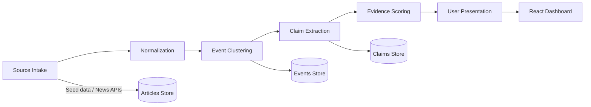

# kill-prop: Source-Triangulation News Analyzer

kill-prop is a news analysis system designed to compare reporting across Western and Russian-source pools, identify overlapping verified facts, flag unsupported or emotionally loaded claims, and expose where framing diverges.

## Features

- **Multi-Source Intake**: Ingests articles from Western mainstream, Russian state-aligned, Russian independent, Chinese state-aligned, and neutral wire sources.
- **Claim Extraction**: Rule-based extraction of atomic claims from article text.
- **Consensus Engine**: Field-by-field resolution with an abstraction ladder ontology — contradictory claims from different pools are collapsed to their safest common abstraction.
- **Contradiction Detection**: First-class contradiction types (event-level, field-level, framing) with a state machine for resolution.
- **Evidence Scoring**: Multi-factor scoring (corroboration × evidence type × source reliability × specificity − framing penalty).
- **Review Console**: Human-in-the-loop review workflow with field overrides and event approval.
- **Interactive Dashboard**: Three-pane event view — facts agreed across sources, disputed claims, and source-bucketed framing.

## Tech Stack

- **Backend**: Python 3.10+, FastAPI, Pydantic v2
- **Frontend**: React 18, TypeScript, Vite, Vitest
- **Storage**: In-memory with JSON file persistence for MVP
- **E2E Testing**: Playwright

## Quick Start

### Prerequisites

- Python 3.10+
- Node.js 18+
- npm

### Using the Launcher (recommended)

```bash
# Linux / macOS
chmod +x kill-prop.sh
./kill-prop.sh

# Windows
double-click kill-prop.bat
```

The launcher automatically creates a virtual environment, installs dependencies, and starts both servers.

### Manual Setup

1. **Backend**:
   ```bash
   cd backend
   python -m venv .venv
   source .venv/bin/activate
   pip install -r requirements.txt
   uvicorn backend.main:app --reload --port 8000
   ```

2. **Frontend**:
   ```bash
   cd frontend
   npm install
   npm run dev
   ```

Then open **http://localhost:5173**.

## Architecture

The system follows a 6-stage pipeline:



### Pipeline Stages

| # | Stage | Description |
|---|-------|-------------|
| 1 | **Source Intake** | Ingest articles from 5 ideological/geographic pools (seed data for MVP) |
| 2 | **Normalization** | Convert surface forms to canonical values (weapon, actor, location, target) |
| 3 | **Event Clustering** | Group related articles by time proximity, topic overlap, and text similarity |
| 4 | **Claim Extraction** | Extract atomic claims with rule-based NLP; optional LLM fallback (TinyLlama) |
| 5 | **Evidence Scoring** | Score claims: 35% corroboration + 25% evidence + 15% reliability + 15% specificity − 10% framing |
| 6 | **Presentation** | Three-layer event view: facts, disputes, and source-bucketed framing |

### Key Algorithms

- **Field Consensus**: Resolves each event argument field independently using an abstraction ladder ontology. If pools disagree on "actor" (e.g., "russian_military" vs "ukrainian_military"), the system abstracts up to the common ancestor ("military_force") and marks the field as disputed.
- **Contradiction State Machine**: `reported → corroborated | disputed_detail → resolved | corrected`
- **Scoring Formula**: `score = 0.35(corroboration) + 0.25(evidence) + 0.15(reliability) + 0.15(specificity) − 0.10(framing)`

## Project Structure

```
├── backend/
│   ├── main.py              # FastAPI app entrypoint
│   ├── models.py            # Pydantic data models & enums
│   ├── storage.py           # JSON file persistence
│   ├── pipeline/
│   │   ├── ingestion.py     # Stage 1: Source intake
│   │   ├── normalization.py # Stage 2: Claim normalization
│   │   ├── clustering.py    # Stage 3: Event clustering
│   │   ├── llm_extraction.py# Stage 4: LLM-based extraction
│   │   ├── consensus.py     # Stage 5a: Field consensus engine
│   │   ├── scoring.py       # Stage 5b: Evidence scoring
│   │   └── llm.py           # TinyLlama provider
│   ├── routers/
│   │   ├── articles.py      # /api/articles routes
│   │   ├── events.py        # /api/events routes
│   │   └── review.py        # /api/review routes (human-in-the-loop)
│   └── tests/               # pytest test suite
├── frontend/
│   ├── src/
│   │   ├── App.tsx          # Main app with sidebar navigation
│   │   ├── types.ts         # TypeScript type definitions
│   │   ├── api/client.ts    # API client with typed endpoints
│   │   └── components/      # React components
│   └── index.html
├── e2e/
│   └── app.spec.ts          # Playwright E2E tests
├── kill-prop.sh             # Linux/macOS launcher
├── kill-prop.bat            # Windows launcher
└── pyproject.toml           # Python project metadata & test config
```

## Supported Sources (seed data)

- **Western Mainstream**: Western Herald
- **Russian State**: Eastern Times, TASS
- **Russian Independent**: Independent Gazette
- **Chinese State**: Xinhua
- **Neutral Wire**: Wire Service

## API Endpoints

| Method | Endpoint | Description |
|--------|----------|-------------|
| GET | `/api/health` | Health check + pipeline stage list |
| GET | `/api/pipeline/run` | Run the full 6-stage pipeline end-to-end |
| POST | `/api/articles/ingest` | Ingest articles (seed data) |
| GET | `/api/articles` | List all articles |
| GET | `/api/articles/{id}` | Get article detail with normalized claims |
| POST | `/api/events/cluster` | Cluster articles into events |
| GET | `/api/events` | List events (with optional filters) |
| GET | `/api/events/{id}` | Get event detail with all three layers |
| GET | `/api/review/events` | List events for review |
| PUT | `/api/review/{id}/notes` | Update review notes |
| POST | `/api/review/{id}/override` | Human override of a field resolution |
| POST | `/api/review/{id}/approve` | Mark event as reviewed |
| POST | `/api/review/{id}/recluster` | Flag event for reclustering |
| GET | `/api/review/dashboard` | Review dashboard stats |

## Environment Variables

| Variable | Default | Description |
|----------|---------|-------------|
| `KILLPROP_STORAGE_DIR` | `~/.killprop/data` | Path for JSON persistence files |
| `USE_LLM` | `false` | Enable TinyLlama-based claim extraction |

## Running Tests

```bash
# Backend tests
cd backend
python -m pytest

# Frontend tests
cd frontend
npm test

# E2E tests (both servers must be running)
npm run test:e2e
```

## License

MIT — see [LICENSE](LICENSE).
