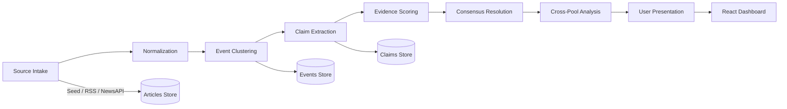

# kill-prop: Source-Triangulation News Analyzer

kill-prop is a propaganda analysis system that compares how the same event is reported across ideologically and geographically diverse source pools. It ingests articles, extracts claims, clusters them into events, identifies cross-pool agreement and disagreement, and surfaces propaganda patterns — with an LLM-powered comparative analysis layer.

## Features

- **Global Source Pools**: 10 pools covering Western mainstream, Russian state, Russian independent, Chinese state, Middle Eastern, Latin American, African, South Asian, East Asian, and neutral wire services.
- **Live News Ingestion**: RSS feeds (BBC, NYT, France 24, RT, TASS, Al Jazeera, The Hindu) + NewsAPI integration with date filtering.
- **Political Topic Filter**: Only politics, geopolitics, military, economy, and propaganda-relevant topics — no sports, entertainment, or local news.
- **Claim Deduplication**: One representative claim per source pool per event (not per source), enabling clean pool-vs-pool comparison.
- **LLM-Powered Extraction**: Optional TinyLlama-1.1B for structured claim extraction with bucket classification, evidence detection, and propaganda flagging.
- **Consensus Engine**: Field-by-field resolution with an abstraction ladder ontology — contradictory claims from different pools are collapsed to their safest common abstraction.
- **Cross-Pool Claim Analysis**: Field-by-field comparison showing exactly how each pool describes the same fact, with LLM-generated qualitative analysis identifying agreements, contradictions, omissions, and loaded language.
- **Propaganda & Framing Analysis**: Aggregated propaganda flag detection (loaded language, us-vs-them framing, certainty without evidence) with source breakdowns.
- **Evidence Scoring**: Multi-factor scoring (corroboration × evidence type × source reliability × specificity − framing penalty).
- **Review Console**: Human-in-the-loop review workflow with field overrides and event approval.
- **Interactive Dashboard**: Event feed, pool-by-pool claim breakdown, cross-pool comparison, propaganda analysis, and human review panel.

## Tech Stack

- **Backend**: Python 3.12, FastAPI, Pydantic v2
- **Frontend**: React 18, TypeScript, Vite 5.4, Vitest
- **Storage**: In-memory dicts with JSON file persistence (`~/.killprop/data/`)
- **LLM**: TinyLlama-1.1B-Chat-v1.0-GGUF (optional, via llama-cpp-python)
- **E2E Testing**: Playwright

## Quick Start

### Prerequisites

- Python 3.12+
- Node.js 18+
- npm

### Using the Launcher (recommended)

```bash
# Linux / macOS
chmod +x kill-prop.sh
./kill-prop.sh

# Windows
double-click kill-prop.bat
```

The launcher automatically creates a virtual environment, installs dependencies, and starts both servers.

To use live NewsAPI feeds, create a `news.env` file with your API key:
```
NEWSAPI_KEY=your_key_here
```

### Manual Setup

1. **Backend**:
   ```bash
   cd backend
   python -m venv .venv
   source .venv/bin/activate
   pip install -r requirements.txt
   uvicorn backend.main:app --reload --port 8000
   ```

2. **Frontend**:
   ```bash
   cd frontend
   npm install
   npm run dev
   ```

Then open **http://localhost:5173**.

## Architecture

The system follows a 6-stage pipeline:



### Pipeline Stages

| # | Stage | Description |
|---|-------|-------------|
| 1 | **Source Intake** | Ingest articles from 10 global pools via seed data, RSS feeds, or NewsAPI |
| 2 | **Normalization** | Convert surface forms to canonical values (weapon, actor, location, target) |
| 3 | **Event Clustering** | Group related articles by time proximity (6h window), topic overlap, and text similarity |
| 4 | **Claim Extraction** | Extract atomic claims with rule-based NLP; optional LLM fallback (TinyLlama) |
| 5 | **Consensus Resolution** | Field-by-field abstraction ladder — conflicting values collapse to common ancestor |
| 6 | **Evidence Scoring** | Score claims: 35% corroboration + 25% evidence + 15% reliability + 15% specificity − 10% framing |
| 7 | **Cross-Pool Analysis** | Field-by-field comparison across pools with LLM-powered qualitative analysis |
| 8 | **Presentation** | Event feed, pool breakdown, cross-pool comparison, propaganda analysis, review console |

### Key Algorithms

- **Field Consensus**: Resolves each event argument field independently using an abstraction ladder ontology. If pools disagree on "actor" (e.g., "russian_military" vs "ukrainian_military"), the system abstracts up to the common ancestor ("military_force") and marks the field as disputed.
- **Contradiction State Machine**: `reported → corroborated | disputed_detail → resolved | corrected`
- **Scoring Formula**: `score = 0.35(corroboration) + 0.25(evidence) + 0.15(reliability) + 0.15(specificity) − 0.10(framing)`
- **Deduplication**: One claim per source pool per event — the claim with the most evidence indicators wins ties broken by claim length.
- **Topic Filtering**: Only articles matching 20+ political/propaganda-relevant tag categories are processed (military, geopolitics, diplomacy, economy, energy, sanctions, etc.)

## Project Structure

```
├── backend/
│   ├── main.py              # FastAPI app entrypoint
│   ├── models.py            # Pydantic data models & enums (10 source pools)
│   ├── storage.py           # JSON file persistence with atomic writes
│   ├── pipeline/
│   │   ├── ingestion.py     # Stage 1: Source intake (seed + RSS + NewsAPI)
│   │   ├── normalization.py # Stage 2: Claim normalization
│   │   ├── clustering.py    # Stage 3: Event clustering + pool dedup
│   │   ├── llm_extraction.py# Stage 4: LLM-based claim extraction
│   │   ├── consensus.py     # Stage 5a: Field consensus engine
│   │   ├── scoring.py       # Stage 5b: Evidence scoring
│   │   └── llm.py           # TinyLlama provider (lazy-loaded)
│   ├── routers/
│   │   ├── articles.py      # /api/articles routes
│   │   ├── events.py        # /api/events routes + cross-pool analysis
│   │   └── review.py        # /api/review routes (human-in-the-loop)
│   └── tests/               # pytest test suite (184 tests)
├── frontend/
│   ├── src/
│   │   ├── App.tsx           # Main app with sidebar navigation
│   │   ├── types.ts          # TypeScript type definitions
│   │   ├── api/client.ts     # API client with typed endpoints
│   │   └── components/
│   │       ├── EventFeed.tsx      # Event list with filtering
│   │       ├── EventCard.tsx      # Event summary card
│   │       ├── EventDetail.tsx    # Full event view with cross-pool analysis
│   │       ├── ArticleViewer.tsx  # Article list + detail
│   │       ├── PipelineRunner.tsx # Pipeline control panel
│   │       └── ReviewConsole.tsx  # Human review dashboard
│   └── index.html
├── e2e/
│   └── app.spec.ts          # Playwright E2E tests
├── kill-prop.sh             # Linux/macOS launcher
├── kill-prop.bat            # Windows launcher
├── pyproject.toml           # Python project metadata & test config
└── package.json             # Root package.json for scripts
```

## Source Pools

The RSS feeds behind each pool are listed in `backend/pipeline/ingestion.py:RSS_FEEDS`. Only the `primary=True` feed in each pool is fetched; the same outlet may legitimately appear as a non-primary reference in another pool without causing duplicate fetches.

| Pool | Primary RSS sources | Regions |
|------|---------------------|---------|
| **Western Mainstream** | BBC News, New York Times | US, UK, Europe |
| **Russian State** | RT, TASS | Russia |
| **Russian Independent** | Meduza | Russia-critical (exile press, Riga) |
| **Chinese State** | Xinhua, CGTN | China |
| **Neutral Wire** | Al Jazeera, The Hindu | Qatar, India |
| **Middle Eastern** | Anadolu Agency, Tehran Times | Turkey, Iran, Arab world |
| **Latin American** | TeleSUR English | Venezuela & Latin America |
| **African** | Daily Trust, The East African | Nigeria, East Africa |
| **South Asian** | Dawn | Pakistan, South Asia |
| **East Asian** | Asia Times, NTV English | Hong Kong/Singapore, Japan |

Notes:
- The default geo-filter restricts the pipeline to Europe/Russia political and military topics. Articles about other regions are only retained when they directly involve Russia or European powers.
- The seed dataset (`SEED_ARTICLES` in `ingestion.py`) is used for offline demos; its timestamps are anchored to "now" at ingest time so the demo always populates regardless of the real wall clock.


## API Endpoints

| Method | Endpoint | Description |
|--------|----------|-------------|
| GET | `/api/health` | Health check + pipeline stage list |
| GET | `/api/pipeline/run` | Run the full pipeline (`?use_llm=true&use_api=true&days_back=1`) |
| POST | `/api/articles/ingest` | Ingest articles (seed data) |
| GET | `/api/articles` | List all articles |
| GET | `/api/articles/{id}` | Get article detail with normalized claims |
| POST | `/api/events/cluster` | Cluster articles into events |
| GET | `/api/events` | List events (filters: `?pool=&min_confidence=&topic=`) |
| GET | `/api/events/{id}` | Get event detail with all three layers |
| GET | `/api/events/{id}/cross-pool-analysis` | Field-by-field cross-pool comparison with LLM analysis |
| PUT | `/api/review/{id}/notes` | Update review notes |
| POST | `/api/review/{id}/override` | Human override of a field resolution |
| POST | `/api/review/{id}/approve` | Mark event as reviewed |
| GET | `/api/review/dashboard` | Review dashboard stats |

## Environment Variables

| Variable | Default | Description |
|----------|---------|-------------|
| `KILLPROP_STORAGE_DIR` | `~/.killprop/data` | Path for JSON persistence files |
| `NEWSAPI_KEY` | (none) | NewsAPI key for live article fetching |

## Running Tests

```bash
# Backend tests (184 tests)
cd backend
python -m pytest

# Frontend tests (99 tests, 7 test files)
cd frontend
npm test

# E2E tests (both servers must be running)
npm run test:e2e
```

## License

MIT — see [LICENSE](LICENSE).
